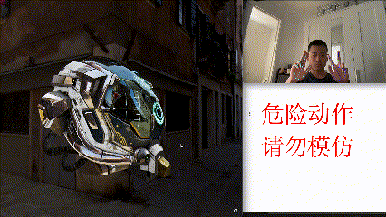

# Hand Gesture Control Project

## Project Overview

This is a hand gesture recognition and control project based on MediaPipe and OpenCV, which can be used to control web models in tres.js.

## Usage

1. Install dependencies:
```
pip install mediapipe opencv-python
```
2. Download the model file `hand_landmarker.task` and place it in the project directory
3. Run the program:
```
python hand_detection.py
```
4. Gesture instructions:
   - Single finger tip closed: Mouse click
   - Distance between two palms: Control scroll wheel
   - Press 'q' to exit the program

## Code Structure

- `hand_detection.py`: Main program file
- `hand_landmarker.task`: MediaPipe hand detection model

## Project Demo



## Notes

1. Requires MacOS system
2. Requires camera permission
3. Ensure sufficient ambient lighting
